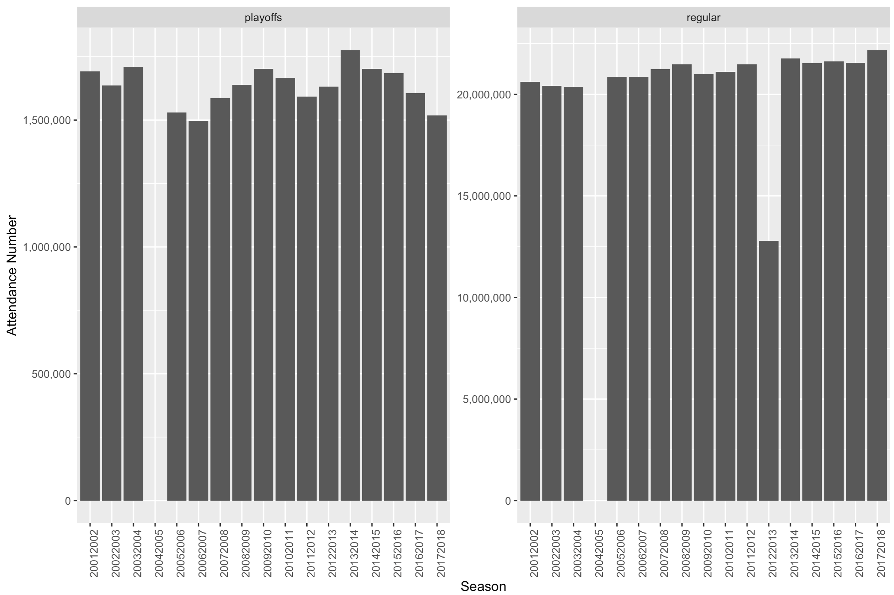
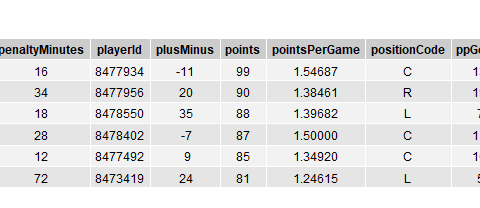
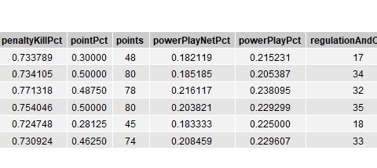

<!-- README.md is generated from README.Rmd. Please edit that file -->

```{r, include = FALSE}
knitr::opts_chunk$set(
  collapse = TRUE,
  comment = "#>",
  fig.path = "man/figures/README-",
  out.width = "100%"
)
```


# rpuck

<!-- badges: start -->
[](https://github.com/UBC-MDS/rpuck/actions) [](https://codecov.io/gh/UBC-MDS/rpuck)

<!-- badges: end -->

If you were to try and analyze statistics for your favorite hockey team, or try to predict an outcome of the next match you'd probably browse the internet in search of convenient tools to get the data you want from the NHL website. While there are a bunch of NHL API packages available in python, there is limited availability of many R packages. Therefore, the rpuck library is designed to allow users the ability to conveniently get both relevant and historical statistics from the publicly available but as of yet undocumented NHL.com API. As of now the package has limited functionality, and is considered a work-in-progress. We will add in additional functionality in the coming weeks which can easily be extended based on feedback we recieve.

## Team

| [Jarvis Nederlof](https://github.com/jnederlo) | [Xugang Zhong](https://github.com/chuusan) | [Polina Romanchenko ](https://github.com/PolinaRomanchenko)| [Manish Joshi](https://github.com/ManishPJoshi)|


## Installation

You can install the released version of rpuck from [CRAN](https://CRAN.R-project.org) with:

``` r
install.packages("rpuck")
```

And the development version from [GitHub](https://github.com/) with:

``` r
# install.packages("devtools")
devtools::install_github("UBC-MDS/rpuck")
```

## Features

- `draft_pick(pick_number=NULL, round_number=NULL, year=NULL)`:
  - The `draft_pick( )` function makes an API call to the drafts summary on the NHL.com API. The function returns information about draft picks for the specified arguments and stores them in a data frame.
  
- `attendance(regular=True, playoffs=True, start_season=NULL, end_season=NULL)`:
  - The attendance( ) function makes a query to the Attendance API to get the seasonal and playoff attendance numbers. The function displays attendance numbers in a ggplot chart.
  
- `team_stats(start_season=NULL, end_season=NULL)`:
  - The `team_stats( )` function makes an API call to the team summary endpoint on the NHL.com API. The function returns team seasonal stats for given seasons sorted by total team points.
  
- `player_stats(start_date=NULL, end_date=NULL)`:
  - The `player_stats( )` function makes an API call to the player summary endpoint on the NHL.com API. The function returns the top 100 player stats for a given date range as sorted by total points.

## Usage

The package can extract and visualize data from NHL statistics in convenient format. Below is an example of how one can use rpuck.

To load the package: 

```r
library(rpuck)
```

Get a chart showing the attendance over a specified time period:

```r
attendance <- attendance(regular=TRUE, playoffs=TRUE, start_season= 2001, end_season=2018)
```



Result of draft by pick number, draft number and year in summary report:

```r
pick <- draft_pick(pick_number = 1, round_number = 2, year = 2019)
```


Query the top 100 player's stats from the player's summary report:

```r
player_s <- player_stats(start_date = "2019-10-02", end_date = "2020-02-28")
head(player_s)
```



Stats for teams specified by start year or start year and end year:

```r
attendance <- team_stats(start_season = "19801981", end_season = "19891990")
head(attendance)
```


  

  
## Tests

We have included a variety of tests for each function in the `tests\testthat` directory. The tests check that the functions error gracefully and that proper function calls return the correct data/objects.

## R Ecosystem 

There are some packages written in the R language that are focused on providing a user with convenient tools to access statistics from NHL.com with API calls and helping to make sense of them. Rpuck is landing in its own niche with compared with such libraries as [nhlapi](https://github.com/zamorarr/nhlapi), [nhlscrape](https://cran.r-project.org/web/packages/nhlscrape/index.html). 


## Dependencies
R version 3.6.1 and R packages:

- dplyr==0.8.3 [@dplyr]
- httr==1.4.1 [@httr]
- ggplot2==3.2.1 [@ggplot2]
- jsonlite==1.6 [@jsonlite]
- grid==3.6.2 [@grid]
- gridExtra==2.3 [@gridExtra]
- glue==1.3.1 [@glue]
- tidyr=1.0.0 [@tidyr]
- testthat==2.3.1 [@testthat]
- scales==1.0.0 [@scales]
